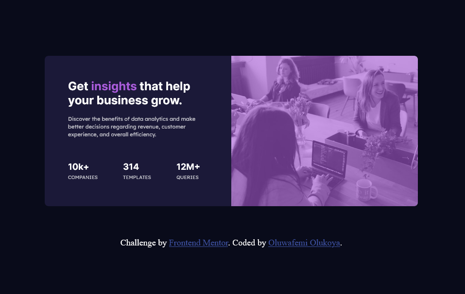

# Frontend Mentor - Stats preview card component solution

This is a solution to the [Stats preview card component challenge on Frontend Mentor](https://www.frontendmentor.io/challenges/stats-preview-card-component-8JqbgoU62). Frontend Mentor challenges help you improve your coding skills by building realistic projects. 

## Table of contents

- [Overview](#overview)
  - [The challenge](#the-challenge)
  - [Screenshot](#screenshot)
  - [Links](#links)
  - [My process](#my-process)
  - [Built with](#built-with)
  - [What I learned](#what-i-learned)
  - [Continued development](#continued-development)
  - [Useful resources](#useful-resources)
- [Author](#author)
- [Acknowledgments](#acknowledgments)

**Note: Delete this note and update the table of contents based on what sections you keep.**

## Overview

### The challenge

Users should be able to:

- View the optimal layout depending on their device's screen size

### Screenshot




### Links

- Solution URL: [Replit Online Coding Area](https://https://replit.com/@Oluwafemi21/stats-card#index.html)
- Live Site URL: [Stats-Card](https://stats-card.oluwafemi21.repl.co/)

## My process

### Built with

- Semantic HTML5 markup
- CSS custom properties
- Flexbox
- CSS Grid
- Desktop-first workflow
- [Styled Components](https://styled-components.com/) - For styles

### What I learned
- I learnt how to give an image a color overlay.

To see how you can add code snippets, see below:

```html
<div class="img">
  
  <div class="overlay"></div>
</div>
```
```css
.img{
  border-radius: 0 8px 8px 0;
  position: relative;
  height: 310px;
}

.overlay{
  position: absolute;
  top: 0;
  left: 0;
  background-color: hsla(277, 64%, 61%,0.6);
  border-radius: 0 8px 8px 0;
  height: 100%;
  width: 100%;
}
```

### Continued development

- Using background images 
- Advanced Css topics like grid and Flexbox

### Useful resources

- [Replit](https://replit.com/@Oluwafemi21/stats-card#index.html)

## Author

- Website - [Oluwafemi Olukoya]
- Frontend Mentor - [@Oluwafemi21](https://www.frontendmentor.io/profile/Oluwafemi21)
- Twitter - [@femi_io](https://www.twitter.com/femi_io)


